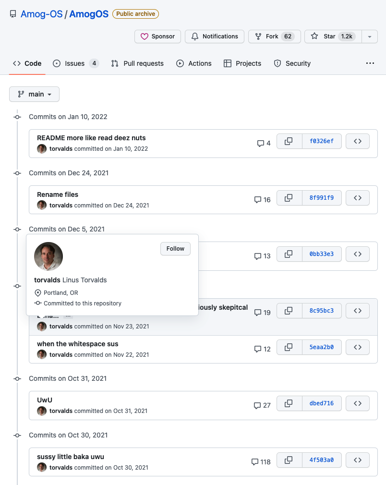
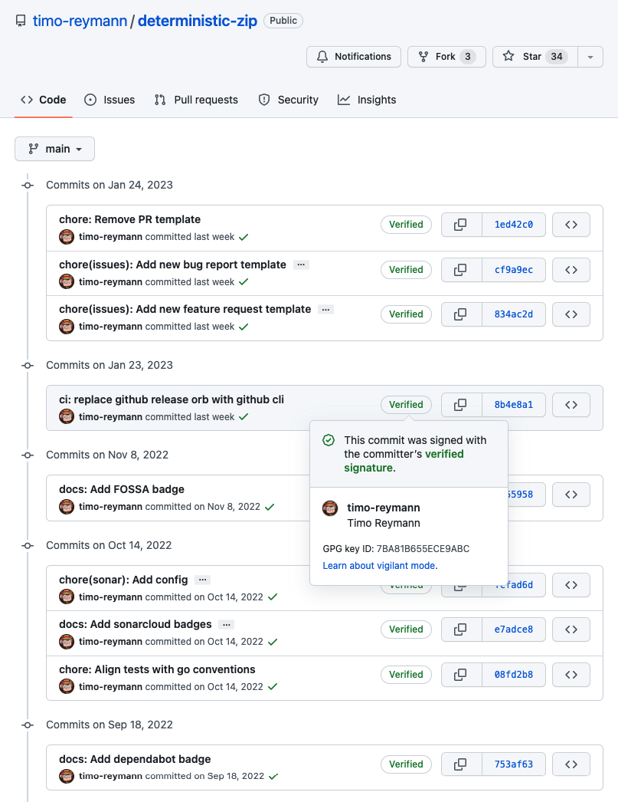
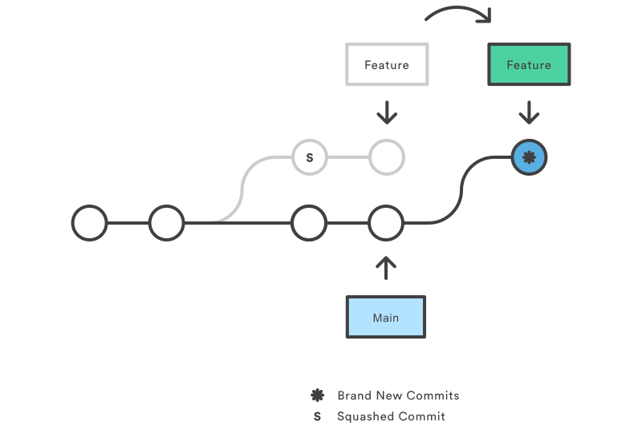
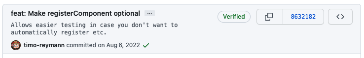

# Deal with (g)it
Top 5 tips to make the best out of (g)it


---
<!-- _class: invert -->
# #1 Sign your commits

Make visible you are the real owner of a commit.

---

# Are these commit from Linus?

- this is a real github repo
- these are real commits

[GitHub: Amog-OS/AmogOS](https://github.com/Amog-OS/AmogOS/commits?author=torvalds)

> Fellow linux redditors may know this already



---

# Anyone can be Linus!

- git config is not verifying anything

So you can set up your local config ...

```shell
git config --global user.name "torvalds"
git config --global user.email "torvalds@osdl.org"
```

... and be Linus:

```shell
touch proof
git stage proof
git commit -m "I am Linus!"
```

... at least thats what its going to look like

---

# Verified commits to the rescue!



- signed with [GPG](https://gnupg.org/)
- visible on all git hosting platforms
- checkable with the git cli


> GPG stands for GNU Privacy Guard and is a free tool to sign and encrypt
> things

---

# Setting it up is easy - 3 steps to victory

1. create a [GPG](https://gnupg.org/) key ([Tutorial](https://docs.github.com/en/authentication/managing-commit-signature-verification/generating-a-new-gpg-key))
2. add the key to your user profile on the git hosting platform (e.g.
[GitHub](https://docs.github.com/en/authentication/managing-commit-signature-verification/adding-a-gpg-key-to-your-github-account))
3. configure your local git installation:
    ```shell
    # set gpg key
    git config --global user.signingkey <key-id>

    # autosign commits
    git config --global commit.gpgsign true
    ```

---

<!-- _class: invert -->
# #2 Keep your history clean

> accountants don't use erasers or they end up in jail

But luckily we are not accountants!

---

<!-- _footer: Image for git squash: [atlassian.com](https://atlassian.com/git/tutorials/rewriting-history) -->
# Squash your feature branches

- powerful feature allowing you to combine multiple commits
- supported by git hosters such as GitHub/GitLab on PRs




---

<!-- _footer: Image for git rebase: [atlassian.com](https://atlassian.com/git/tutorials/rewriting-history/git-rebase) -->
# Rebase your changes

- local repo is not up to date
- main branch has evolved faster than feature branch
- smaller changes most of the time don't need to be merged


---

<!-- _class: invert -->
# #3 Simplify your daily life

Git and your shell has more to offer than just builtin commands!

---

# Add helper tools

- any command thats prefixed with `git-` can be a git command
- [git-semver-tag](https://github.com/timo-reymann/git-semver-tag) becomes `git semver-tag`

---

# Create alias in your git config

- entire shell command
- another subcommand

e.g. here are mine:
```ini
[alias]
p = pull
squash-all = "!f(){ git reset $(git commit-tree HEAD^{tree} -m \"${1:-A new start}\");};f"
sync = "!f() { git pull --rebase && git push; };f"
```

---

# Alias entire git commands

- for the extreme lazy
- add to your shellrc

```shell
# use gpush
alias gpush = "git push"

# use commit "my message"
alias commit = "git stage . && git commit -m"
```

---

<!-- _class: invert -->
# #4 Use branches and tags wisely

Nothing is immutable by default.

---

# Choose the right branching concept

- trunk based development is a valid choice
- build your workflow around the real world, not some theory
- commiting to the main branch is not (always) a sin
- be creative and think out of the box
- don't see branching concepts as a religion

---

# Tags are not immutable

- tags can be changed and deleted, making them also work as pointers
- that can break dependency pins
- only unique thing in git are commit hashes

---

<!-- _class: invert -->
# #5 Rely on conventions
Who doesn't love conventions?

---

<!-- _footer: Learn more here: https://conventionalcommits.org/ -->
# Commit with respect to conventional commits

- be specific about your impact
- short and concise description
- explain details in the body

The format is super simple:

```text
<type>[(optional scope)]: <description>

[optional body]

[optional footer(s)]
```

---

# Use the commit body

- the commit can have a body, use it when required
- collapses by default in web UIs and toolings
    - when viewing the history:
     

    - after clicking on the dots:
      

---

<!-- _footer: Learn more here: https://conventionalcomments.org/-->
# Use Conventional Comments on PRs

- no more undertone in your comments
- clear scope and less words to type and read
- take time for praise as well

The format, again, is super simple:

```text
<label> [(decorations)]: <subject>

[discussion]
```

---

# Recap

- sign your commits with GPG
- keep the history clean, dont hesitate to use erasers
- make your daily life easier with git and shell alias as well as third party packages and scripts
- be aware tags and branches are mutable all the way, only reliable thing are commit hashes
- use conventions for commits and PRs, don't forget about the message body


---

<!-- _class: invert -->
# Q&A

Questions, concerns, ideas? - Now is the time

---

# That's (g)it

Slides (Source):
[github/timo-reymann/slides-deal-with-git](https://github.com/timo-reymann/slides-deal-with-git/)

Slides (HTML):
[deal-with-git.slides.timo-reymann.de](https://deal-with-git.slides.timo-reymann.de/)
<hr />

Twitter: [@timo_reymann](https://twitter.com/timo_reymann)
GitHub: [timo-reymann](https://github.com/timo-reymann)


